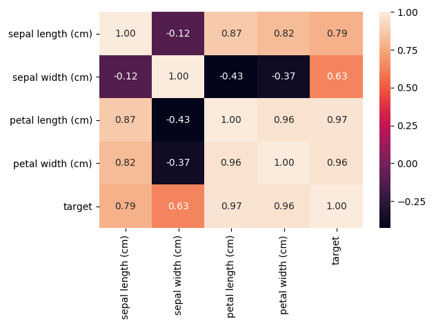
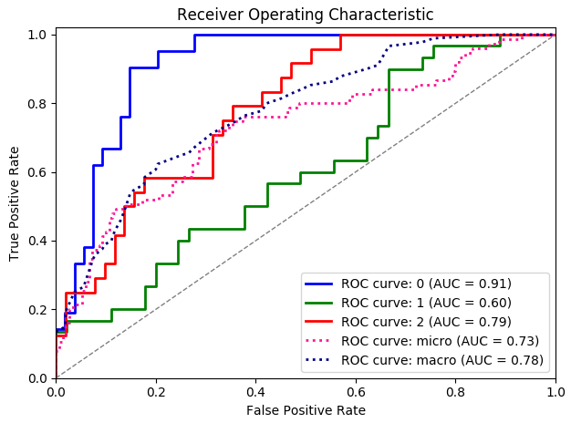

# Examples

_Examples can be imported and executed from `dython.examples`._

#### `associations_example()`

Plot an example of an associations heat-map of the Iris dataset features 
(using Cramer's V).

**Example code:**
```python
import pandas as pd
from sklearn import datasets
from dython.nominal import associations

# Load data 
iris = datasets.load_iris()

# Convert int classes to strings to allow associations method 
# to automatically recognize categorical columns
target = ['C{}'.format(i) for i in iris.target]

# Prepare data
X = pd.DataFrame(data=iris.data, columns=iris.feature_names)
y = pd.DataFrame(data=target, columns=['target'])
df = pd.concat([X, y], axis=1)

# Plot features associations
associations(df)
```
**Output:**



__________________

#### `roc_graph_example()`

Plot an example ROC graph of an SVM model predictions over the Iris dataset.

Based on `sklearn` examples (as was seen on April 2018):
http://scikit-learn.org/stable/auto_examples/model_selection/plot_roc.html

**Example code:**
```python
import numpy as np
from sklearn import svm, datasets
from sklearn.model_selection import train_test_split
from sklearn.preprocessing import label_binarize
from sklearn.multiclass import OneVsRestClassifier
from dython.model_utils import roc_graph

# Load data
iris = datasets.load_iris()
X = iris.data
y = label_binarize(iris.target, classes=[0, 1, 2])

# Add noisy features
random_state = np.random.RandomState(4)
n_samples, n_features = X.shape
X = np.c_[X, random_state.randn(n_samples, 200 * n_features)]

# Train a model
X_train, X_test, y_train, y_test = train_test_split(X, y, test_size=.5, random_state=0)
classifier = OneVsRestClassifier(svm.SVC(kernel='linear', probability=True, random_state=0))

# Predict
y_score = classifier.fit(X_train, y_train).predict_proba(X_test)

# Plot ROC graphs
roc_graph(y_test, y_score, class_names=iris.target_names)
```

**Output:**



Note that due to the nature of `np.random.RandomState` which is used in this 
example, the output graph may vary from one machine to another.