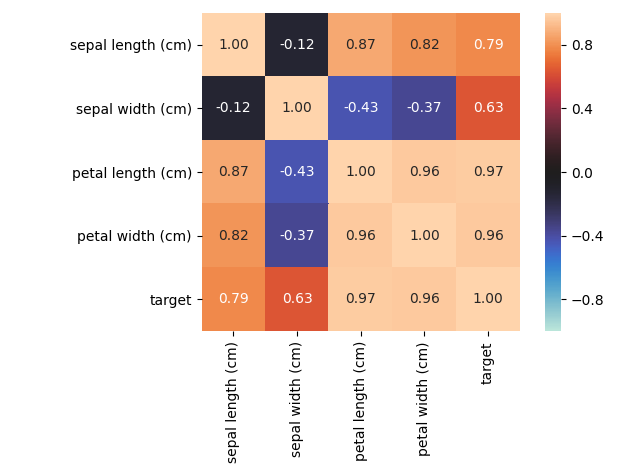
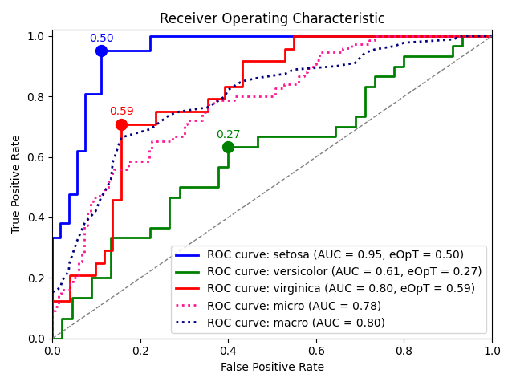

# Summary  

Exploratory data analysis (EDA) frequently requires quantifying and visualizing associations between variables. In datasets with mixed variable types (continuous and categorical), analysts must manually choose suitable metrics (Pearson's R, correlation ratio, Cramér’s V, Theil’s U, etc.), compute them, then assemble the results and plot, often with custom logic. The **`dython`** package automates much of this workflow: it inspects variable types, computes suitable association measures, returns a clean tabular result. 

As `dython` was designed to be used for research, it puts an emphasis on the visual plots generated by its core methods, providing
highly-readable and customizable visualizations of the output, treating those as a core component rather than a by-product.

In short, **`dython`** lowers the friction for inter-variable association analysis in mixed-type datasets and improves reproducibility of EDA workflows.

# Statement of Need  

While there are many statistical and visualization libraries in Python (e.g. `pandas` [@pandas], `scipy` [@scipy], `scikit-learn` [@scikit-learn], `seaborn` [@seaborn]), they treat continuous data, categorical data and the overall visualization separately. Users often resort to custom glue code to:  

1. determine which columns are categorical vs numeric,  
2. choose an appropriate association statistic (e.g. Pearson for numeric–numeric, correlation ratio for numeric–categorical, Cramér’s V or Theil’s U for categorical–categorical),  
3. compute those pairwise,  
4. assemble a matrix or graph,  
5. annotate, visualize, and interpret the results.

This fragmentation results in boilerplate, inconsistency, or mistake-risk, especially in exploratory settings or pipelines.  

**`dython`** addresses this gap by providing a unified, high-level API that:  

- **infers variable types** 
 
- **automatically selects appropriate measures** 
 
- **returns structured and annotated output**
  
- **offers visualization** (heatmaps, annotation) integrated
   
- **offers model evaluation tools** (ROC, AUC, thresholding) for classification tasks

Therefore, **`dython`** helps data scientists, statisticians, and researchers spend less time writing glue code and more time focusing on insights.

# Functionality  

Below is a non-exhaustive overview of core modules and features. For full API and examples, see the documentation.  

## Associations  

* `dython.nominal.associations(df, theil_u=False, plot=False, return_results=False, **kwargs)`  
  Computes pairwise associations across all columns in a pandas DataFrame `df`. Internally, for each pair, it selects a measure appropriate to the variable types:

  - continuous–continuous → Pearson correlation (or Spearman, if configured)  
  - continuous–categorical → correlation ratio  
  - categorical–categorical → Cramér’s V or Theil’s U  

  It outputs a pandas DataFrame (square matrix) of association values and optionally produces a heatmap (with annotations).  

  Example usage:

  ```python
  from dython.nominal import associations
  assoc_df = associations(my_df, theil_u=True, plot=True)
  ```

## Model evaluation

* `dython.model_utils.metric_graph(y_true, y_pred, metric='roc', **kwargs)`
    This utility helps visualize classification performance. For a given true-label array y_true and predicted scores y_pred, it can plot ROC curves, compute AUC for each class (in multiclass settings), and show threshold recommendations.
    Example:
    ```python
    from dython.model_utils import metric_graph
    metric_graph(y_true, y_pred_probs, metric='roc')
    ```

* `dython.model_utils.ks_abc(y_true, y_pred, **kwargs)`
    Perform the Kolmogorov–Smirnov test over the positive and negative distributions of a binary classifier, and compute the area between curves.
    Example:
    ```python
    from dython.model_utils import ks_abc
    ks_abc(y_true, y_pred_probs)
    ```

# Related work
Several libraries provide components somewhat overlapping `dython`’s functionality:

* `scipy.stats` [@scipy], `statsmodels` [@statsmodels] — full support for continuous correlations and tests, but limited categorical association tools

* `scikit-learn` [@scikit-learn] — mutual information, label encoding, classification metrics, but lacks seamless cross-type association matrices

* `pingouin` [@pingouin] — a statistical package including correlation, effect sizes, but does not integrate categorical–categorical measures like Theil’s U or automatic visualization

# Installation

You can install the released version via:

* **`pip`**: `pip install dython`

* **`conda`**: `conda install -c conda-forge dython`

* **Source**: `pip install git+https://github.com/shakedzy/dython.git`

Dependencies include standard scientific Python packages such as 
`numpy` [@numpy], 
`pandas` [@pandas], 
`scipy` [@scipy], 
`scikit-learn` [@scikit-learn], 
`matplotlib` [@matplotlib], 
and `seaborn` [@seaborn].

# Example workflow
**A minimal example using `associations`**:

```python
import pandas as pd
from sklearn import datasets
from dython.nominal import associations

# Load dataset
iris = datasets.load_iris()

# Convert int classes to strings to allow associations method
# to automatically recognize categorical columns
target = ["C{}".format(i) for i in iris.target]

# Prepare data
X = pd.DataFrame(data=iris.data, columns=iris.feature_names)
y = pd.DataFrame(data=target, columns=["target"])
df = pd.concat([X, y], axis=1)

# Plot features associations
associations(df)
```

This would output:




**A minimal example using `metric_graph`**:
```python
from sklearn import datasets, svm
from sklearn.preprocessing import label_binarize
from sklearn.model_selection import train_test_split
from sklearn.multiclass import OneVsRestClassifier
from dython.model_utils import metric_graph


# Load data
iris = datasets.load_iris()
X = iris.data
y = label_binarize(iris.target, classes=[0, 1, 2])

# Add noisy features
random_state = np.random.RandomState(4)
n_samples, n_features = X.shape
X = np.c_[X, random_state.randn(n_samples, 200 * n_features)]

# Train a model
X_train, X_test, y_train, y_test = train_test_split(
    X, y, test_size=0.5, random_state=0
)
classifier = OneVsRestClassifier(
    svm.SVC(kernel="linear", probability=True, random_state=0)
)

# Predict
y_score = classifier.fit(X_train, y_train).predict_proba(X_test)

# Plot ROC graphs
return metric_graph(
    y_test, y_score, "roc", class_names_list=iris.target_names
)
```

This would output:




# Usage Mention

Throughout its lifetime, `dython` has been used in many projects, including:

* [Official implementation](`https://github.com/yandex-research/tab-ddpm`) of TabDDPM [@tabddpm] by [Yandex Research](https://research.yandex.com)

* [`gretel-synthetics`](https://github.com/gretelai/gretel-synthetics/tree/a0e712852f74c238ce848456952e90a141e8da2a) by [Gretal.ai](https://gretel.ai)

* [`torchmetrics`](https://github.com/Lightning-AI/torchmetrics?tab=readme-ov-file) by [Lightning AI](https://lightning.ai)

* [`ydata-quiality`](https://github.com/ydataai/ydata-quality) by [YData](https://ydata.ai)


# Acknowledgements

The author thanks users and contributors who have filed issues, submitted pull requests, or suggested enhancements, as well as the authors and 
communities of the foundational packages on which `dython` builds.